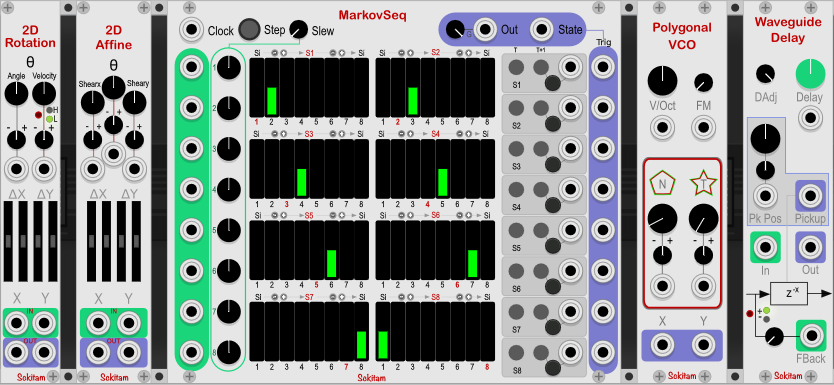
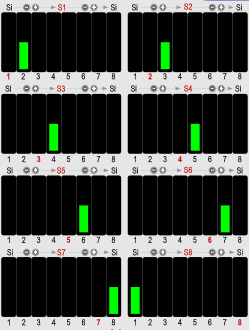
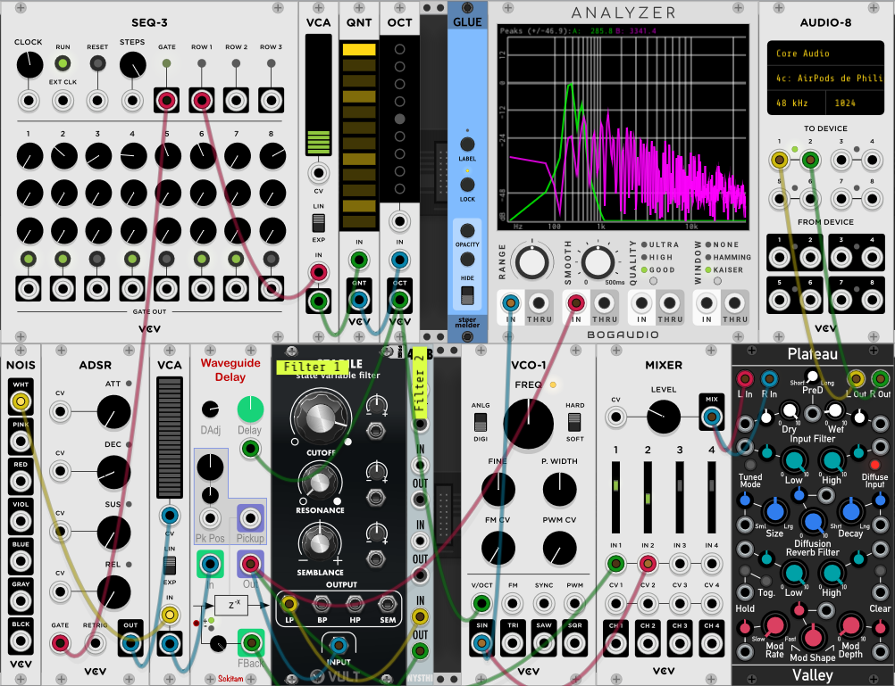

## Sckitam plugin for VCV Rack

This page provides some information about the following modules:

* **[2DRotation](#2DRotation)**: Utility, 2D Rotation of 2 input signals
* **[2DAffine](#2DAffine)**: Utility, 2D Affine Transform of 2 intput signals
* **[MarkovSeq](#MarkovSeq)**: Sequencer & Switch, 8 steps sequencers based on Markov chain
* **[PolygonalVCO](#PolygonalVCO)**: VCO based on the paper: C. Hohnerlein, M. Rest, and J. O. Smith III, “Continuous
order polygonal waveform synthesis,” in Proceedings of the
International Computer Music Conference, Utrecht, Netherlands, 2016.
* **[WDelay](#WDelay)**: High precision delay line. Building block for Waveguide and Karplus-Strong synthesis as well as Flanger or Chorus effects. 

The context menu allows one to choose between light or dark panel (Currently not available for the WDelay). 

## 2DRotation 

The two input signals, X and Y, are considered as the horizontal and vertical displacements on a 2D plane. They form a curve. The module mix them following a rotation rule. The two output signals are defined by:

Out1 = cos(\theta) X - sin(\theta) Y

Out2 = sin(\theta) X + cos(\theta) Y

The **Angle** value in the range +/-pi is defined by the knob on the left. The angle can be CV modulated. The range of CV from +/-5V corresponds to +/-pi. 

The **Velocity** of the rotation can be specified by the knob on the right. The range of rotation values has two modes. In the low (L) velocity mode, the velocity can reach +/-90 rotations per second. In the high (H) velocity mode, the rotation is specified by a 1V/Oct rule. If the knob is at 0, the velocity corresponds to 261.63 rotations per second (C4). Each increment of +/-1 will mutiply/divide the number of rotations per second by a factor of 2. The velocity parameter can also be CV modulated.  

The two sliders below \Delta X (\Delta Y) respectively define a horizontal (vertical) translation before and after the rotation. This allows one to precisely position the curve in the 2D space if necessary. 

X & Y input and output are polyphonic. The actual number of channels is defined by the X input port.

## 2DAffine 

Same as the [2DRotation](#2DRotation) without the velocity parameter but with two additional shearing parameters, Sx and Sy. The shearing is applied before the rotation:

Out1 = cos(\theta) (X + Sx Y) - sin(\theta) (Sy X + Y)

Out2 = sin(\theta) (X + Sx Y) + cos(\theta) (Sy X + Y)

The shearing creates horizontal and vertical deformations of the curve in the 2D plane. Note that the shearing can modify very significantly the signal dinamic. As a result, a (parabolic) saturator has been introduced at the output.  

X & Y input and output are polyphonic. The actual number of channels is defined by the X input port.

## MarkovSeq 

**8 steps sequencer or 8 to 1 switch**: This module defines 8 states and each incoming clock generates a **new state** which is defined by probabilities associated to the **current state**. This is essentially a first order 
[Markov Chain](https://en.wikipedia.org/wiki/Markov_chain) and allows one to define a graph of events with associated transition probabilities. The transition probabilites from each current state, S1,...,S8, are defined by the central part of the module. 

Each slider specifies the relative probability to go from the current state to one of the next state. Note that the probabilities are relative in the sense that they are normalized by the sum of the 8 values associated to the possible transitions. As a result, if all sliders have the same value, all possible next states are equiprobable (independently of the actual value the sliders may have). As a special case, if all slider values are equal to 0, the context menu allows one to choose either to remain in the current state or to assume that transitions to any states are equiprobable. 

As the number of probabilities to specify is 64, their definition can be cumbersome. Presets can be used. However beside presets, "-" and "+" buttons have been introduced to support the probability definition task. Above each set of sliders, 4 buttons are provided. The example below shows the case of state S2:  

The two buttons on the left of S2 modifies the probabilities of all states (Si) that may come to state 2. The "-" button sets these probabilities to 0. This means that S2 will not be reached any more. The "+" button sets the probabilities to 0.5. 

The two buttons on the right of S2 modifies the probabilities of S2 to go to all possible states (Si). The "-" button sets these probabilities to 0. The "+" button sets these probabilities to 0.5. 

The probabilities initialization is done such that the sequencer moves as a regular sequencer in the forward direction: 

The states are visualized on the right side of the module: 

The current state is shown in red and the next state (the one that will be triggered by the next clock gate) in blue. The next state can also be forced either manually with the associated button or by a gate signal. 

The left part of the module defines the values that are used to generate the output value for each current state. 

All input ports and the output port are polyphonic (the actual number of channels is defined by the input port of state 0). For each current state, the output is the sum of the incoming signal at the corresponding input port and the value of the knob (the transitions between values defined by the knobs can be smoothed by a Slew knob).
If the input is polyphonic, the value of the knob value is added to all channels. The module can therefore be used as a sequencer, an 8 to 1 switch or a combination of both. The final output can also be scaled by a Gain parameter. 

The current state value (value between 0 and 7) is also available at one output port. Finally, for each transition,
a trigger is sent to the Trig output port of the current state: 
 

## PolygonalVCO 

This is an oscillator based on the sampling of a 2D curve, here a polygon of order N, by a rotating phasor. It generates two output signals X and Y corresponding to the projection of the sampling on the horizontal and vertical axes. 

The VCO was proposed in C. Hohnerlein, M. Rest, and J. O. Smith III, “Continuous order polygonal waveform synthesis,” in Proceedings of the
International Computer Music Conference, Utrecht, Netherlands, 2016; and further discussed in C. Hohnerlein, M. Rest and J. Parker, "Efficient anti-aliasing of a complex polygonal oscillator", 20th International Conference on Digital Audio Effects (DAFx17), Edinburgh, Scotland, 2017.

The oscillator has essentially two parameters: 

1. **N: Order of the polygon**. Its value ranges from 2.1 up to 20 and can be CV modulated. High values of N create polygons that converge towards a circle and the resulting waveforms are cosine (X) and sine (Y) waves. Lower N values generate signals with richer harmonic content. If one wants to restrict the possible set of harmonic variations, the N parameter can be quantized. The context menu provides several quantization step options: "None", "0.25", "0.33", "0.50" or "1.00"
2. **T: Teeth**: This parameter creates "teeth" shapes on the corners of the polygon. These shapes increase the harmonic content of the signals.    

The oscillator is polyphonic. The actual number of channels is defined by the pitch signal. The FM signal is assumed to have as many channels as the pitch signal. The N and T CV ports *may* also be polyphonic. If they are monophonic, their value is applied on all channels (otherwise individual values are used for each channel).
 
In order to minimize the CPU load, no visual representation of the curve is included in the module itself. However, as shown in the figure above, the use of an additional scope is highly recommended, at least for sound design.

## WDelay 

This module is a simple building block for Digital Waveguide and Karplus-Strong synthesis. It can also be used to create Flanger or Chorus. It is a high precision delay where the output is computed with 3rd order Lagrange interplotation. Beside the main output, a secondary output called "pickup" is also available. It allows one to extract the signal at an arbitrary position of the delay buffer. 

#### Input 
1. "In": Input port of the delay.  
2. "FBack": Input port for the feedback signal. Note that, by default, the output signal is not routed back to the input of the delay. A connection has to be explicitely done. One of the motivation of this module is to allow experimenting with different filters (or possibly other type of processing) inserted in the feedback loop. The FBack signal is scaled by a knob (values between 0 and 0.999) and may be mutipled by 1 or -1 before being fed back to the delay. 

#### Output
1. "Out": Main output of the delay.
2. "Pickup": Signal extracted at an arbirary position of the delay buffer. A knob specifies the position: 0 corresponds to the input of the delay buffer and 1 to the output of the delay buffer. The position can be CV modulated.   

#### Delay specification
The delay can be defined in two different ways that can be selected by the context menu "Delay specification....".

1. Pitch: The Delay knob defines the length of the delay so that a given pitch is produced in the context of a Karplus-Strong synthesis approach. The input port is interpreted as 1V/Oct. 
2. Time: In this case, the delay is directly defined in ms (values between 0.1ms up to 1.0s). The modulation is interpreted as: Delay*(1+CVvalue/5).

Finally, the "DAdj" (delay adjustment) is provided for fine tuning of the delay time. It allows one to shorten the delay time by an arbitrary value corresponding to a time between 0 and 16 sample periods. This is particularily useful in the "Pitch" mode. As the feedback is not created by default, the simplest connection involves a cable connecting the output port to the feedback input port. In VCV, this cable implies one sample delay. At high frequencies, this extra sample delay may have a significant impact on the pitch. Therefore, the "DAdj" can be set to -1 to shorten the length of the delay so that the complete scheme "Delay + cable" has exactly the intended length. If filters or other processing blocks are inserted in the feedback loop, their delay should be compensated if a precise Pitch definition is necessary. 

In the following example: 

[Patch available here](doc/Karplus_Strong.vcv)

the feedback loop involves the "Stabile" filter as well as a "DC" blocking filter (They are marked as "Filter 1" and "Filter 2"). The connection involves 3 cables. So the DAdjust should be at least of -3. In fact, a fine tuning with a tuner shows that the filters themeselves add a small amount of extra delay. The final delay adjustment is set to -3.284. A VCO was added to check the tuning of the Karplus-Strong voice compared to a pure sine wave.  

