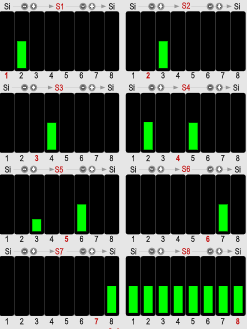

## Sckitam plugin for VCV Rack

This page provides some information about the following plugins:

* **[2DRotation](#2DRotation)**: Utility, 2D Rotation of 2 input signals
* **[2DAffine](#2DAffine)**: Utility, 2D Affine Transform of 2 intput signals
* **[MarkovSeq](#MarkovSeq)**: Sequencer & Switch, 8 steps sequencers based on Markov chain

## 2DRotation 

The two input signals, X and Y, are considered as the horizontal and vertical displacements on a 2D plane. They form a curve. The plugin mix them following a rotation rule. The two output signals are defined by:

Out1 = cos(\theta) X - sin(\theta) Y

Out2 = sin(\theta) X + cos(\theta) Y

The \theta value defined by the knob can be CV modulated.
The range of CV from +/-5V corresponds to +/-pi. The two sliders below \Delta X (\Delta Y) respectively define a horizontal (vertical) translation before and after the rotation. This allows one to precisely position the curve in the 2D space. 

## 2DAffine 

Same as the [2DRotation](#2DRotation) with two additional shearing parameters, Sx and Sy. The shearing is applied before the rotation:

Out1 = cos(\theta) (X + Sx Y) - sin(\theta) (Sy X + Y)

Out2 = sin(\theta) (X + Sx Y) + cos(\theta) (Sy X + Y)

The shearing creates horizontal and vertical deformations of the curve in the 2D plane. 

## MarkovSeq 

**8 steps sequencer or 8 to 1 switch**: This plugin defines 8 states and each incoming clock generates a **new state** which is defined by probabilities associated to the **current state**. This is essentially a first order 
[Markov Chain](https://en.wikipedia.org/wiki/Markov_chain) and allows one to define a graph of events with associated transition probabilities. The transition probabilites from each current state, $$S_0,...,S_7$$, are defined by the central part of the plugin. 

Each slider specifies the relative probability to go from the current state to one of the next state. Note that the probabilities are relative in the sense that they are normalized by the sum of the 8 values associated to the possible transitions. As a result, if all sliders have the same value, all possible next states are equiprobable (independently of the actual value the sliders may have). As a special case, if all slider values are equal to 0, all next states are also equiprobable. 

The states are visualized on the right side of the plugin: 

The current state is shown in red and the next state (the one that will be triggered by the next clock gate) in blue. The next state can also be forced either manually with the associated button or by a gate signal. 

The left part of the plugin defines to the values that are used to generate the output value for each current state. 

For each current state, the output is the sum of the incoming signal at the corresponding input port and the value of the knob (the transitions between values defined by the knobs can be smoothed by a Slew knob). The plugin can therefore be used as a sequencer, an 8 to 1 switch or a combination of both. The final output can also be scaled by a Gain parameter. Finally, the current state value is also available at one output port. 

 
